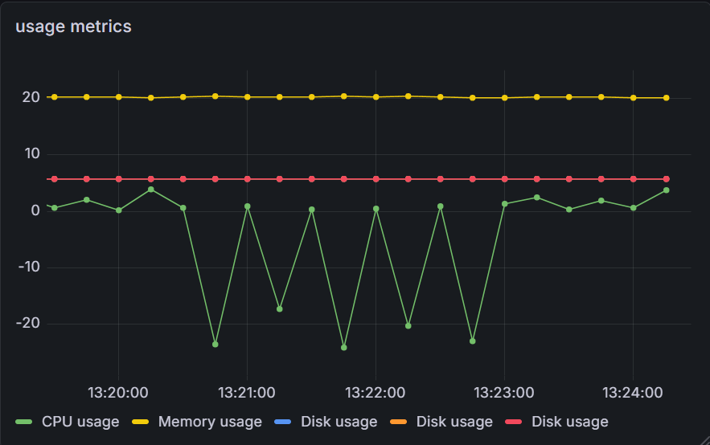
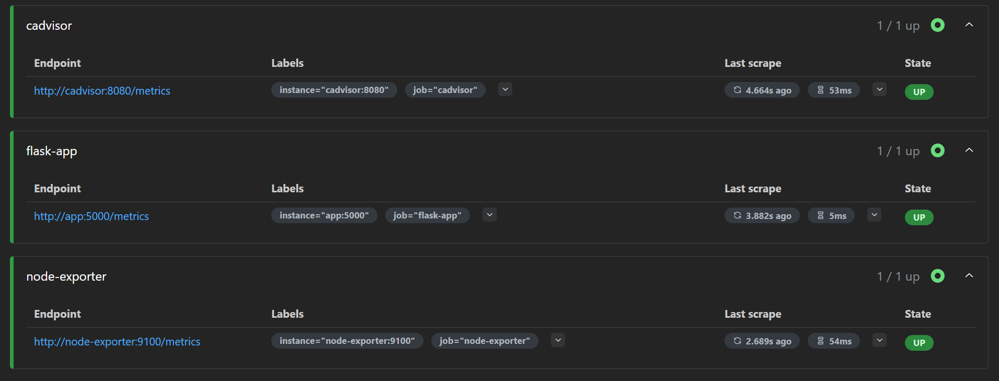
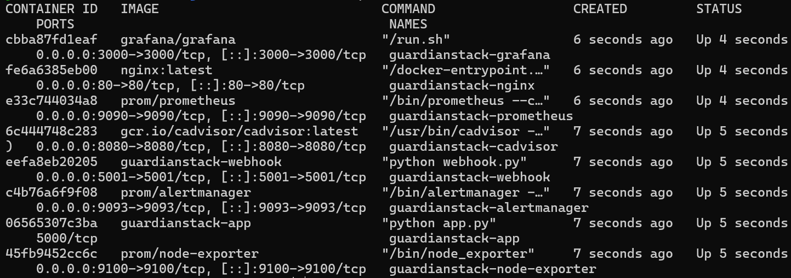
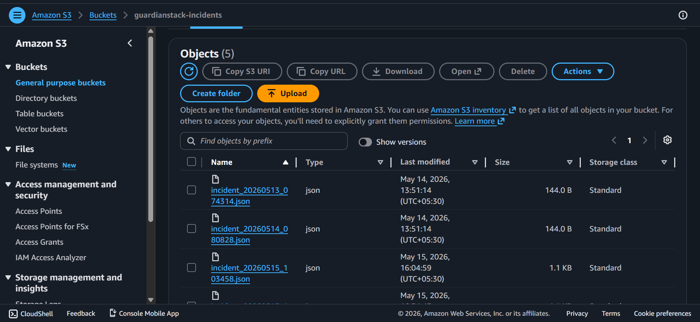

# GuardianStack

> Containerized Monitoring & Incident Automation Platform built with Docker, Prometheus, Grafana, Alertmanager, AWS S3, GitHub Actions, and AWS EC2.

GuardianStack is a production-style monitoring and incident management platform designed to monitor containerized applications, detect failures automatically, trigger alerts, archive incidents, and deploy continuously using CI/CD pipelines.

The project combines observability, automation, cloud deployment, and infrastructure monitoring into a single Dockerized stack.

---

# Architecture Diagram


---

# Features

- Reverse proxy using NGINX
- Flask application with custom Prometheus metrics
- Real-time infrastructure and container monitoring
- Prometheus metrics collection and alert evaluation
- Alert routing using Alertmanager
- Automated webhook-based incident handling
- Incident archival to AWS S3
- Grafana dashboards for visualization
- Docker Compose orchestration
- CI/CD automation using GitHub Actions
- Automatic deployment to AWS EC2
- Multi-container cloud deployment

---

# Tech Stack

| Category | Technologies |
|---|---|
| Backend | Python, Flask |
| Monitoring | Prometheus, Node Exporter, cAdvisor |
| Visualization | Grafana |
| Alerting | Alertmanager |
| Reverse Proxy | NGINX |
| Containerization | Docker, Docker Compose |
| Cloud | AWS EC2, AWS S3 |
| CI/CD | GitHub Actions |
| OS | Linux (Ubuntu) |

---

# System Workflow

```text
User Request
↓
NGINX Reverse Proxy
↓
Flask Application
↓
Prometheus Scrapes Metrics
↓
Alert Rules Evaluated
↓
Alertmanager Routes Alerts
↓
Webhook Receives Incident
↓
Incident Stored as JSON
↓
Incident Uploaded to AWS S3
```

---

# Infrastructure Components

| Service | Purpose | Port |
|---|---|---|
| Flask App | Main application | 5000 |
| NGINX | Reverse proxy | 80 |
| Prometheus | Metrics collection & alerting | 9090 |
| Grafana | Dashboard visualization | 3000 |
| Alertmanager | Alert routing | 9093 |
| cAdvisor | Container metrics | 8080 |
| Node Exporter | Host metrics | 9100 |
| Webhook Service | Incident processing | 5001 |

---

# Monitoring Stack

GuardianStack uses multiple monitoring components together:

- **Prometheus** scrapes application and infrastructure metrics
- **Node Exporter** collects host-level metrics
- **cAdvisor** collects container metrics
- **Grafana** visualizes metrics through dashboards
- **Alertmanager** handles alert routing and notifications

---

# Alerting Workflow

The platform automatically detects failures using Prometheus alert rules.

Example flow:

```text
Flask Application Down
↓
Prometheus Detects Failure
↓
Alertmanager Fires Alert
↓
Webhook Receives Payload
↓
Incident Logged as JSON
↓
Incident Uploaded to AWS S3
```

---

# CI/CD Pipeline

GuardianStack includes automated CI/CD pipelines using GitHub Actions.

## Continuous Integration (CI)

On every push:

- Validates Docker Compose configuration
- Builds Docker containers
- Detects infrastructure issues early

## Continuous Deployment (CD)

On successful push to `main`:

- GitHub Actions connects to EC2 via SSH
- Pulls latest repository changes
- Rebuilds Docker containers
- Restarts the monitoring stack automatically

---

# AWS Deployment

GuardianStack is deployed on an AWS EC2 Ubuntu instance using Docker Compose.

The deployment includes:

- Public cloud hosting
- Dockerized services
- Automated CI/CD deployment
- Multi-container orchestration
- Persistent monitoring infrastructure

---

# Screenshots

## Architecture Diagram


---

## Grafana Dashboard



---

## Prometheus Targets



---

## Alert Firing


---

## Docker Containers



---

## AWS S3 Incident Storage



---

## GitHub Actions CI/CD


---

# Project Structure

```text

guardianstack/
│
├── app/
├── nginx/
├── prometheus/
├── alertmanager/
├── incident-logger/
├── screenshots/
├── .github/workflows/
├── docker-compose.yml
└── README.md
```

---

# Setup Instructions

## 1. Clone Repository

```bash
git clone https://github.com/YOUR_USERNAME/guardianstack-monitoring-platform.git
cd guardianstack-monitoring-platform
```

---

## 2. Configure AWS Credentials

Configure AWS CLI credentials for S3 uploads:

```bash
aws configure
```

---

## 3. Start GuardianStack

```bash
docker compose up --build -d
```

---

# Access Services

| Service | URL |
|---|---|
| Main Application | `http://YOUR_PUBLIC_IP` |
| Grafana | `http://YOUR_PUBLIC_IP:3000` |
| Prometheus | `http://YOUR_PUBLIC_IP:9090` |
| Alertmanager | `http://YOUR_PUBLIC_IP:9093` |

---

# Challenges Faced

Some real-world engineering challenges encountered during development:

- Docker container networking issues
- Prometheus `/metrics` endpoint debugging
- YAML indentation and configuration errors
- GitHub Actions workflow permission issues
- SSH authentication for automated deployment
- AWS credential mounting inside containers
- Container rebuild and orchestration debugging
- Prometheus alert rule validation

---

# Future Improvements

- Terraform Infrastructure as Code
- Kubernetes deployment
- HTTPS with NGINX and Certbot
- Authentication for Grafana dashboards
- Slack/Discord alert integration
- Centralized logging stack
- Multi-environment deployments

---

# Learning Outcomes

This project helped strengthen practical skills in:

- Linux server management
- Docker orchestration
- Cloud deployment on AWS
- Infrastructure monitoring
- Observability engineering
- CI/CD automation
- Alerting systems
- Infrastructure debugging
- Production-style system design

---

# Author

**Juhee Lavanya**

Built as part of a cloud and DevOps learning journey focused on infrastructure, monitoring, automation, and deployment engineering.
